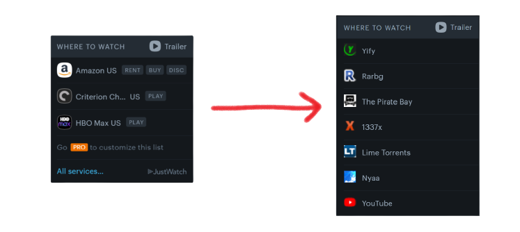

<br />
<p align="center">
  <a href="https://github.com/1netanel/letterboxd-services.git">
    
  </a>  
  
  <h3 align="center">Letterboxd Services</h3>

  <p align="center">
    Letterboxd Extension that provides you torrents for movies.
    <br/>
    <br/>

## About The Project

<br />


<br/>

Idea is taken from [here](https://github.com/Hame-daani/letterboxd_util).

Letterboxd Services is a Chrome extension that will make your life easier by providing you torrents for movies traight through [letterboxd](https://letterboxd.com/) movie page.

## How to Use

To use the extension, download it [manualy](#manual-installation).

## Supported Providers

-  &nbsp; Yify
-  &nbsp; Rarbg
-  &nbsp; The Pirate Bay
-  &nbsp; 1337x
-  &nbsp; Lime Torrents
-  &nbsp; Nyaa
-  &nbsp; YouTube

## Example


## License

[MIT](LICENSE)

## Contributing

Pull requests and issues are welcome.

## Manual Installation

1. Clone the repo

   ```sh
   git clone https://github.com/1netanel/letterboxd-services.git
   ```

### Chrome

2. Open Chrome and go to **chrome://extensions**

3. Toggle on **Developer mode** checkbox in the top right-hand corner.

4. Click the **Load unpacked extension** button and select the folder **chrome-firefox**.

### Firefox

2. Open Firefox and go to **about:debugging#addons**

3. Click **Temporary Extensions**

4. Click the **Load Temporary Add-on…** and select the **manifest.json** file from the folder **chrome-firefox**.
